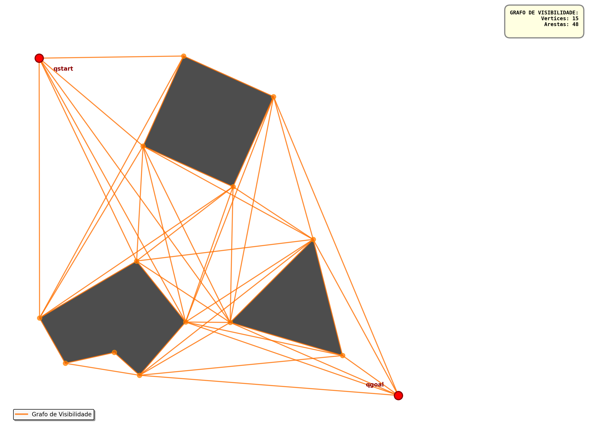
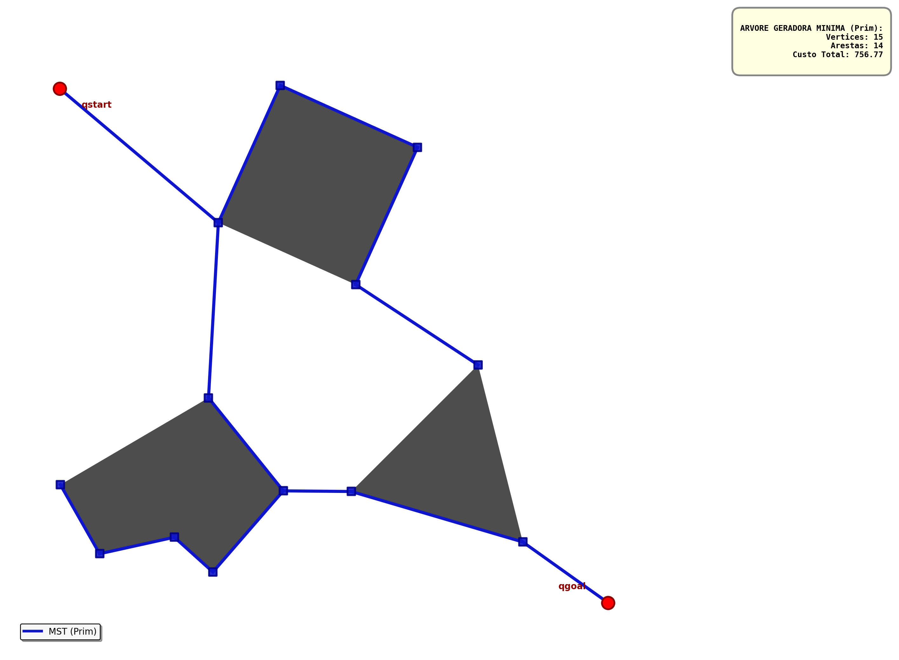
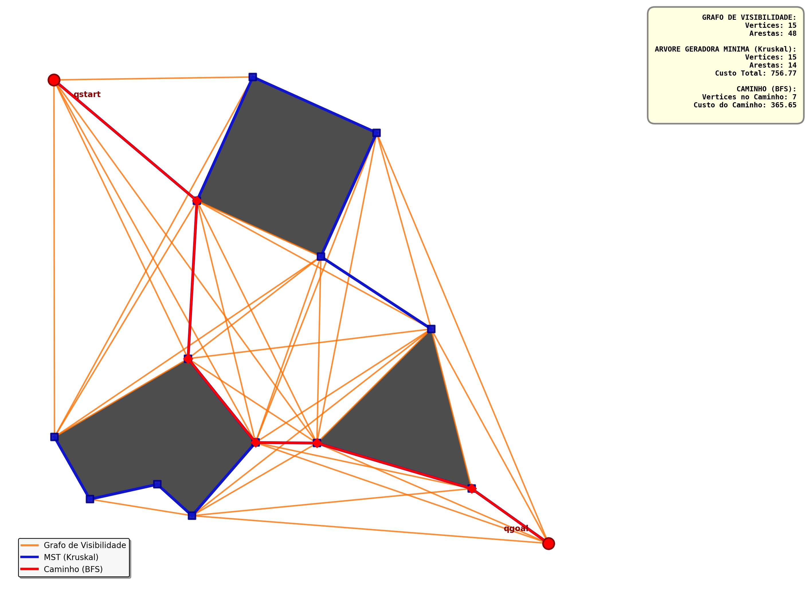

# Planejamento de Caminho para Robôs Autônomos
Sistema de navegação baseado em Grafos de Visibilidade e Árvores Geradoras Mínimas para planejamento de trajetórias em ambientes com obstáculos poligonais.

## 👥 Autores:

- Jean Felipe Duarte Tenório 
- Alison Bruno Martires Soares


 Instituição: UFAL
 
 Disciplina: Teoria dos Grafos
 
 Professor: Glauber Rodrigues Leite
 
 Data: Novembro/2025


## 📋 Descrição do Projeto:
Este projeto implementa um sistema completo de planejamento de caminho para veículos autônomos navegando em ambientes 2D com obstáculos. O sistema utiliza conceitos de teoria dos grafos para criar um roadmap que permite ao robô navegar de qualquer ponto a outro, evitando colisões.


## 🚀 Como Executar:

### Pré-requisitos

### Python 3.8 ou superior:
```
python --version
```
### Instalar dependências:

```
pip install -r requirements.txt

```

### Navegar para Pasta e Executar a Main:

```
cd Caminho_Planejamento_Robo

python robot_navegation.py

```
## 📁 Estrutura do Projeto:

```
Caminho_Planejamento_Robo/
├── robot_navegation.py           ← Main(Arquivo Principal)
├── Mapa/
|   ├── bitmap.pdf
|   ├── bitmap.png
|   ├── bitmap.svg
|   ├── map1.txt
├── Modulos/
│   ├── __init__.py
│   ├── models.py                 ← Classes Point e Obstacles
│   ├── visibility_graph.py       ← VisibilityGraph
│   ├── kruskal.py                ← kruskal
|   ├── prim.py                   ← prim               
│   ├── pathfinding.py            ← BFS, vertice_mais_proximo
├── Resultados/                   
|   ├── 01_visibilidade.png
|   ├── 02_mst_kruskal.png
|   ├── 02_mst_prim.png
|   ├── 03_caminho_kruskal.png
|   ├── 03_caminho_prim.png
|   ├── 04_resultado_unificado_kruskal.png
|   ├── 04_resultado_unificado_prim.png
|   ├── mapa_plotado.png
├── Testes/                       
|   ├── test.py ← Testes de Funcionalidades
|
├── Utils/                       
│   ├── __init__.py
│   └── file_reader.py    ← Leitura do arquivo map1.txt
│   └── plotar_caminho.py ← Plotagem caminho(Arquvo Excecução(Testes))
│   └── plotar_mapa.py  ← Lógica Principal integra plotagem de mapa,grafos visibilidade,MST,caminho c
│   └── plotar_mst.py   ← Plotagem Árvore Geradora Mínima(Arquivo Execução(Testes))
│   └── plotar_visibilidade.py ← plotagem Grafo de Visibilidade(Arquivo Execução(Testes))
├── README.md
|── LICENSE
└── requirements.txt
```

📄 Formato do Arquivo de Mapa:
```
q_start_x, q_start_y          # Posição inicial
q_goal_x, q_goal_y            # Posição final
<numero_de_obstaculos>        # Quantidade de obstáculos
<numero_de_vertices_obs_1>    # Vértices do obstáculo 1
x1, y1
x2, y2
...
<numero_de_vertices_obs_2>    # Vértices do obstáculo 2
x1, y1
...
```
## 🔍 Resultados Visuais:


### 1. Mapa com Obstáculos:

<p align="center">
  
</p>


### 2. Grafo de Visibilidade:

<p align="center">
  
</p>


### 3. Árvore Geradora Mínima (Kruskal / Prim):

#### 3.1 Kruskal:

<p align="center">
  
</p>

#### 3.2 Prim:

<p align="center">
  
</p>


### 4. Caminho Encontrado:

#### 4.1 Caminho Encontrado Resultado Kruskal:

<p align="center">
  
</p>

#### 4.1 Caminho Encontrado Resultado Prim:

<p align="center">
  
</p>

## Implementação dos Algoritmos

### **Conceito Base: Visibilidade entre Vértices**
Dois vértices v_i e v_j têm uma aresta se: **e_ij ≠ ∅ ⟺ s·v_i + (1-s)·v_j ∈ cl(Q_free), ∀s ∈ [0,1]**


---

## Algoritmo de Prim (MST)

### Pseudocódigo Teórico:
```
início [ dados: grafo G = (V,E) valorado nas arestas ] ; valor ← ∞; custo ← 0;
T ← {1}; E(T) ← ∅; T e E(T): vértices e arestas da árvore ]
enquanto | T | < n – 1 fazer
  início
  para todo k ∈ T fazer [ examinar vértices já escolhidos ]
  início
    para todo i ∈ V – T fazer [ examinar vértices ainda não escolhidos ]
    se v_ki < valor então
    início
      valor ← v_ki; vesc ← k; vnovo ← i;
    fim;
  fim;
  custo ← custo + valor; T ← T ∪ {vnovo}; E(T) ← E(T) ∪ (vesc, vnovo); valor ← ∞;
  fim;
fim.
```

### O que foi implementado (prim.py):

**Estruturas de Dados Utilizadas:**
- `in_mst`: conjunto (set) para armazenar vértices já incluídos na árvore (equivalente ao T do pseudocódigo)
- `pq`: heap de prioridade (heapq) para armazenar arestas candidatas com seus pesos (tuplas: `(peso, origem, destino)`)
- `mst_edges`: lista para armazenar as arestas que formam a MST final

**Otimização Implementada:**

Em vez de varrer todos os vértices a cada iteração (como no pseudocódigo original O(n²)), utilizamos um **heap de prioridade** que automaticamente mantém as arestas ordenadas por peso. Isso melhora a complexidade para **O(E log V)**.

**Fluxo do Algoritmo:**

1. **Inicialização:**
   - Seleciona o primeiro vértice do grafo como ponto de partida (ou um vértice específico, se fornecido)
   - Adiciona esse vértice ao conjunto `in_mst`
   - Insere todas as arestas conectadas a esse vértice no heap

2. **Loop Principal:**
   - Enquanto houver arestas no heap e ainda existirem vértices não incluídos:
     - Remove a aresta de **menor peso** do heap (`heapq.heappop`)
     - Verifica se o vértice destino já está na MST (evita ciclos)
     - Se não estiver, adiciona a aresta à MST e o vértice ao conjunto `in_mst`
     - Insere todas as novas arestas do vértice recém-adicionado no heap

3. **Construção do Grafo MST:**
   - A função `build_mst_graph()` converte a lista de arestas em um dicionário de adjacências bidirecional
   - Cada aresta (v1, v2, peso) gera duas entradas: `adj[v1][v2]` e `adj[v2][v1]`

**Diferenças chave em relação ao pseudocódigo:**
- Uso de heap ao invés de busca linear para encontrar a aresta de menor peso
- Verificação explícita de ciclos com `if v2 in in_mst`
- Acumulação do peso total da MST para estatísticas

---

## Busca em Largura - BFS (Pathfinding)

### Pseudocódigo Teórico:
```
início [ dados: grafo G = (V,E) e um vértice fonte s ∈ V ]

  para todo v ∈ V faça
    explorado[v] ← falso; d[v] ← ∞;
  fim;
  
  explorado[s] ← verdadeiro;
  d[s] ← 0;
  
  Q ← ∅; [ Q: uma fila ]
  ENFILEIRAR(Q, s);
  
  enquanto Q ≠ ∅ fazer
  início
    u ← DESENFILEIRAR(Q); [ u: vértice sendo processado ]
    
    para todo v adjacente a u fazer
    início
      se não explorado[v] então
      início
        explorado[v] ← verdadeiro;
        d[v] ← d[u] + 1;
        ENFILEIRAR(Q, v); [ insere v no fim da fila ]
      fim;
    fim;
  fim;
  
fim.
```

### O que foi implementado (pathfinding.py):

**Estruturas de Dados Utilizadas:**
- `queue`: fila implementada com `deque` (double-ended queue) do módulo collections
- `visited`: conjunto (set) para armazenar vértices já explorados (equivalente ao `explorado[]` do pseudocódigo)
- `parent`: dicionário que mapeia cada vértice ao seu predecessor no caminho (usado para reconstruir o caminho final)

**Funcionalidade `bfs_path(start, goal, mst_graph)`:**

1. **Validações Iniciais:**
   - Verifica se os vértices inicial e final existem no grafo
   - Trata o caso especial onde início e fim são o mesmo vértice
   - Retorna `None` se não houver caminho válido

2. **Inicialização do BFS:**
   - Adiciona o vértice inicial (`start`) à fila
   - Marca o vértice inicial como visitado
   - Define o pai do vértice inicial como `None` (não tem predecessor)

3. **Exploração em Largura:**
   - Remove o primeiro vértice da fila (`queue.popleft()`)
   - Se for o vértice objetivo, reconstrói o caminho usando o dicionário `parent`
   - Caso contrário, explora todos os vizinhos não visitados:
     - Marca cada vizinho como visitado
     - Registra o vértice atual como pai do vizinho
     - Adiciona o vizinho à fila para exploração futura

4. **Reconstrução do Caminho:**
   - Ao encontrar o objetivo, percorre o dicionário `parent` de trás para frente
   - Começa no `goal` e vai até o `start` (onde `parent[start] = None`)
   - Inverte a lista para obter o caminho na ordem correta

---

## Função Auxiliar: `close_vertex`

### O que foi implementado (pathfinding.py):

**Funcionalidade `close_vertex(ponto, mst_graph)`:**

Esta função não está presente no pseudocódigo teórico, mas é essencial para conectar a posição do robô (que pode estar em qualquer ponto do espaço livre) à MST construída.

**Implementação:**
- Recebe a posição atual do robô (um `Point`) e o grafo MST
- Itera sobre todos os vértices do grafo
- Calcula a distância euclidiana entre o ponto do robô e cada vértice
- Retorna o vértice mais próximo (menor distância)

**Utilidade no Sistema:**
- Permite que o robô "se conecte" à MST a partir de qualquer posição
- É chamada tanto para a posição inicial quanto para a posição final
- Garante que sempre haja um ponto de entrada/saída válido na árvore geradora
